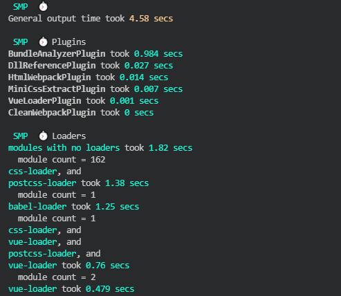
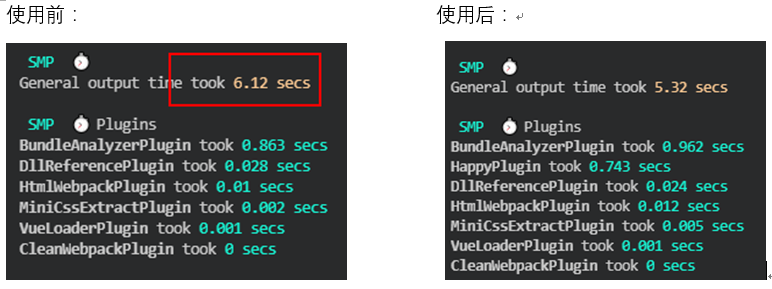
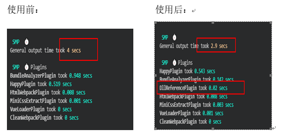

<!--
 * @Description: webpack构建优化
 * @Autor: huangdi8
 * @Date: 2021-07-30 10:13:26
 * @LastEditors: huangdi8
 * @LastEditTime: 2021-10-08 09:52:04
-->
<h3>webpack构建优化（速度）</h3>
<h4>概述</h4>
  webpack是一个用于现代JavaScript应用程序的静态模块打包工具，是前端开发中用的比较多的模块打包工具，在实际开发过程中只需要做一些简单的配置就可以实现打包，实现了打包目的，就需要考虑怎样能够在项目中提高打包的速度，提升工作的效率。本文主要是考虑怎样实现打包优化，所以这里不对webpack基础结构知识点做说明，具体可以直接参考webpack官网<a>https://webpack.docschina.org/blog/</a>。<br>

<h4>优化方法</h4>
  既然是优化，那我们就需要知道打包各个文件的时候，哪些文件花了多少时间，从而能够知道要把精力放在哪些地方，这里可以使用speed-measure-webpack-plugin插件，它可以输出打包过程中各个阶段发生的时间。结果显示如下图所示。
  
  

  配置实现：
  ```
    const SpeedMeasurePlugin = require("speed-measure-webpack-plugin");
    const smp = new SpeedMeasurePlugin();
    // config为webpack的配置
    module.exports = smp.wrap(config)
  ```
  1、使用HappyPack去开启多进程<br>
  首先因为在实际做项目的时候，特别是大项目的话，会有很多的文件需要处理，那么处理loader解析的量就会非常大，而js又是单线程的，因此，从这个方向入手，在打包的时候可以引入多进程，将这些任务分解到多个子进程中去处理，子进程执行完之后将结果全部在返回给主进程，从而减少构建时间。下面是使用前后对比图。<br>

  
  
  通过对比，可以明显看出总体的打包时间从6.12减少到了5.32，达到了我们的优化目的。这里没有把单个的loader打包花费时间展示出来，可自己去做测试，所以这里只需要参考第一个SMP,看总体的输出时间即可。<br>
  配置实现：
  ```
  // 首先安装happypack
  const HappyPack = require('happypack')
  // 共享进程池，这里是为了多个HappyPack实例都使用同一个共享进程池中的子进程去处理任务，为了防止资源占用过多
  const happyThreadPool = HappyPack.ThreadPool({
    size: os.cpus().length
  })
  // 把module.rules中的js解析loader交给id为jsLoader的happypack实例去执行
  module: {
    rules: [
      //...省略其它配置
      {
        test: /\.js$/,
        use: [
          {
            loader: 'happypack/loader?id=jsLoader'
          }
        ]
      }
    ]
  }
  // 创建HappyPack插件实例
  new HappyPack({
    id: 'jsLoader',
    loaders: [
      // 这里就写相关的loader就可以了，不做赘述
    ],
    threadPool: happyThreadPool
  })
  ```
  2、抽离第三方插件<br>
    在实际的项目中，经常会引入很多第三方库，比如vue，element-ui等等，对于这些库，如果在不升级的情况下，都是不会改变的，因此实际上不用每次修改本地代码打包的时候又将这些第三方文件在打包一次，只需要在第一次打包的时候打包第三方库，其它的时候就只有升级第三方库的时候才需要重新打包，所以这里使用webpack内置的DllPlugin DllRefrencePlugin来进行第三方库的抽离，下面是抽离前后打包时间对比图.<br>
    

  根据使用前后对比，抽离第三方插件之后，打包时间提升了1.1。因为这里引入的第三方库不多，所以只对vue和elementui进行了抽离，在具体的项目中可根据实际的需求去做抽离。<br>
  配置实现：<br>
  ```
  // 这里可以新建一个webpack的配置，专门用来编译抽离第三方库的文件。
    module.exoprts = {
      entry: {
        vendor: ['vue', 'element-ui']
      },
      output: {
        path: path.resolve(__dirname, 'dist', 'dll'),
        filename: '[name].dll.[hash:6].js',
        // 这里的library的值要与webpack.DllPlugin中的name保持一致
        library: '[name]_library'
      },
      plugins: [
        new webpack.DllPlugin({
          path: path.resolve(__dirname, '[name]-mainfest.json'),
          name: '[name]_library',
          context: __dirname
        })
      ]
    }
    // 在webpack主线配置中添加该插件
    module.exports = {
      // ... 省略配置
      plugins: [
         new Webpack.DllReferencePlugin({
          context: __dirname,
          manifest: path.resolve(__dirname, 'dist', 'dll', 'manifest.json')
        })
      ]
    }
  ```
  当然，除了上述两个比较常用的，还有一些比如通过配置include，exclude,alias等属性缩小文件的搜索范围，使用optimiza-css-assets-webpack-plugin进行css的压缩，使用缓存等等。这些也是可以缩短文件的打包时间的方式。><br>
  【注】在使用optimiza-css-assets-webpack-plugin压缩css的时候需要引入uglifyjs，因为原本打包会自动压缩js，但是使用了css压缩之后，对原本的js压缩会有影响，所以需要引入uglifyjs。

  本文主要是从打包速度的方向去进行优化，对于webpack的打包优化还可以从文件的体积入手，后期会在给出一个针对体积优化的总结。